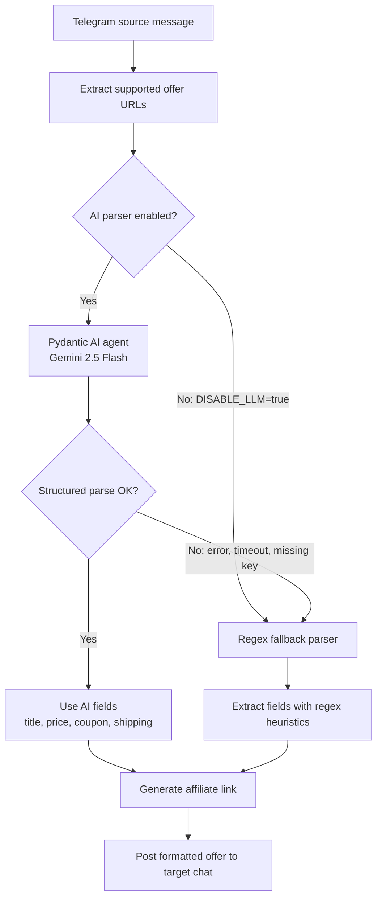

# Telegram Offers Bot

Bot user account listens to source Telegram groups, extracts Mercado Livre, Amazon, Shopee, and AliExpress URLs, generates your affiliate link, then posts to target group.

## Parsing Architecture

The bot now uses an AI parsing layer first. Telegram messages are sent to a structured Pydantic AI agent backed by Gemini (`gemini-2.5-flash`), which classifies each message as either a product deal or a generic coupon bulletin and extracts clean fields such as title, price, installment info, shipping, coupon, and Meli+ restrictions.

The older regex parser is still present, but it is now the fallback path. It runs only when the AI layer is disabled, missing credentials, or fails/timeouts. URL extraction and platform-specific affiliate conversion still happen after parsing.



## Setup

1. Create Telegram API credentials at `https://my.telegram.org/apps`.
2. Copy `.env.example` to `.env`.
3. Fill:
   - `TELEGRAM_API_ID`
   - `TELEGRAM_API_HASH`
   - `SOURCE_CHATS` with comma-separated source groups/channels
   - `TARGET_CHAT` with your group id, `@name`, or invite link
   - `ML_AFFILIATE_TAG`
   - `ML_COOKIE_HEADER`
   - `ML_CSRF_TOKEN`
   - `SHOPEE_APP_ID`
   - `SHOPEE_APP_SECRET`
   - `AMAZON_AFFILIATE_TAG`
   - `AMAZON_COOKIE_HEADER`
   - `AMAZON_MARKETPLACE_ID`
   - `ALIEXPRESS_APP_KEY`
   - `ALIEXPRESS_APP_SECRET`
   - `ALIEXPRESS_TRACKING_ID`
   - `GEMINI_API_KEY` for the AI parsing layer
   - `LITELLM_API_BASE` only if routing Gemini through LiteLLM
   - `DISABLE_LLM=true` only when you want to force the regex fallback parser
4. Install deps:

```powershell
python -m venv .venv
.\.venv\Scripts\Activate.ps1
pip install -r requirements.txt
python -m playwright install chromium
```

5. Run:

```powershell
python run.py
```

First run asks Telegram login code. Session stored as `TELEGRAM_SESSION`.

Test one link conversion alone:

```powershell
python -m offers_bot.check_link "https://www.mercadolivre.com.br/creatina-monohidratada-250g-growth-supplements-sem-sabor-em-po/p/MLB19603205"
```

```powershell
python -m offers_bot.check_link "https://www.amazon.com.br/dp/B0DXR6MKR8?tag=yourtag-20"
```

```powershell
python -m offers_bot.check_link "https://s.shopee.com.br/LjpppnYGZ"
```

```powershell
python -m offers_bot.check_link "https://s.click.aliexpress.com/e/_c4LBE5wb"
```

## Deploying to Coolify (or Docker)

Because Telegram requires an interactive login code the first time you connect, you cannot perform the initial login directly inside a Coolify/Docker deployment. 

1. **Generate the session locally:**
   Run the bot on your local machine first (`python run.py`). Enter your phone number and the OTP code. This will generate a file named `offers_bot.session`.
2. **Upload the session file to your server:**
   Use SSH or SFTP to upload `offers_bot.session` to your server. Place it in the directory where your Coolify project stores its data (e.g., `/data/coolify/applications/<app_id>/`).
3. **Important Docker Pitfall:**
   You **MUST** ensure the `offers_bot.session` file exists on the host server **before** you start the Coolify deployment. 
   *Why?* If Docker tries to bind-mount a file that doesn't exist on the host, it will automatically create an empty **directory** with that name. When the bot starts, SQLite will try to open that directory as a database and crash with `sqlite3.OperationalError: unable to open database file`.
4. **Deploy:**
   Once the file is securely on the host server, deploy your app from Coolify.

## Troubleshooting & Known Issues

### 1. `sqlite3.OperationalError: unable to open database file`
This usually happens due to a **Docker Bind Mount conflict**.
*   **Cause:** If you configure a mount for `offers_bot.session` in Coolify/Docker, but the file does not exist on the host when the container starts, Docker will create a **directory** named `offers_bot.session`. When the bot tries to open it as a database file, it fails.
*   **Fix:** 
    1. Stop the container.
    2. On the host, run `rm -rf offers_bot.session` to delete the incorrect directory.
    3. Ensure your real `.session` file is placed there as a file.
    4. Restart the container.
*   **Pro-tip:** Use a subfolder for the session (e.g., `TELEGRAM_SESSION=data/offers_bot`). Since the `data/` folder is already a directory mount, it is much more stable than mounting individual files.

### 2. `EOFError: EOF when reading a line`
*   **Cause:** The bot is asking for a Telegram login code but cannot receive input (common in Docker). This means it **failed to find or load a valid session file**.
*   **Check:**
    1. Verify `TELEGRAM_SESSION` path matches your file location.
    2. Ensure `TELEGRAM_API_ID` and `TELEGRAM_API_HASH` match the ones used to create the session file. If they differ, the session is invalidated.
    3. Check file permissions (`chmod 664`).

### 3. `telethon.errors.rpcerrorlist.FloodWaitError`
*   **Cause:** Telegram has temporarily throttled your account for making too many requests (like joining too many groups or trying to login too many times).
*   **Fix:** You **must wait** the exact number of seconds specified in the error message. There is no workaround. Stop the bot and wait before trying again, or you risk longer bans.

### 4. Safe Session Update Pattern
If you need to update or move your session file on a live server, always follow this sequence to prevent Docker from creating "ghost" directories:
1.  **Stop** the container (`docker stop <container_id>`).
2.  **Delete** the old file/directory on the host.
3.  **Copy** the new `.session` file to the destination path.
4.  **Set permissions** (`chown ubuntu:ubuntu` and `chmod 664`).
5.  **Start** the container again.

## Mercado Livre Credentials

`task-context.md` shows browser request shape for `createLink`. Do not commit cookie or CSRF values. Put them in `.env`:

```env
ML_COOKIE_HEADER=_d2id=...; ssid=...; ...
ML_CSRF_TOKEN=...
ML_AFFILIATE_TAG=your-ml-tag
```

Cookies expire. When Mercado Livre starts returning 401/403, capture fresh cookie + CSRF from browser devtools while logged into affiliate hub.

## Amazon Credentials

Use the authenticated request to `associates/sitestripe/getShortUrl` while logged into your Amazon Associates account. Put the values in `.env`:

```env
AMAZON_COOKIE_HEADER=session-id=...; ubid-acbbr=...; ...
AMAZON_AFFILIATE_TAG=yourtag-20
AMAZON_MARKETPLACE_ID=526970
```

The bot resolves the incoming Amazon URL, replaces any existing `tag` with your own Associates tag, adds `linkCode=sl2`, then calls the same SiteStripe shortener endpoint.

## AliExpress Credentials

Use AliExpress Affiliate API credentials. Put them in `.env`:

```env
ALIEXPRESS_APP_KEY=...
ALIEXPRESS_APP_SECRET=...
ALIEXPRESS_TRACKING_ID=default
```

The bot resolves incoming AliExpress short URLs, extracts the product id when available, builds a BR coin-index product URL, then calls `aliexpress.affiliate.link.generate` to create your promotion link.

## Shopee Credentials

Use Shopee Affiliate Open API credentials. Put them in `.env`:

```env
SHOPEE_APP_ID=...
SHOPEE_APP_SECRET=...
```

Bot resolves incoming `https://s.shopee.com.br/...` short URL, extracts final `-i.<shop_id>.<item_id>` ids from redirected product URL when available, then calls Shopee Affiliate GraphQL API `generateShortLink` to create your short link. It also uses `productOfferV2` to fetch the product image when product ids are available.

## Notes

- Scraping other Telegram groups needs your user account to be member of those groups. Normal bot accounts cannot read arbitrary groups.
- `POLL_EXISTING_MESSAGES=true` processes latest 50 messages from each source at startup.
- SQLite dedupe lives at `data/offers.sqlite3`.
- AI parser token usage is stored in SQLite under the `token_usage` table.
- Private invite links can be joined/resolved by Telethon only when your account has access.
- `BROWSER_RESOLVER_ENABLED=true` uses headless Chromium to open affiliate/profile links, find the `Ir para produto` URL, then convert that real product URL into your affiliate link.
- `BROWSER_DEBUG_DIR=data/browser-debug` saves HTML/screenshot when Chromium cannot find the product URL.
